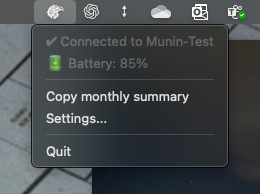

# 🐦‍⬛ Munin

Munin helps you track time for different tasks during your work day. Each face represents a different activity — just flip the cube to start logging time for a specific task (ex. _"Product support"_, _"Emails"_, _"Coding"_ etc). Add labels to each side if you want.

- 3D-printed
- Bluetooth connected
- Subscription-free (unlike for example Timeular and EARLY)
- Hackable

Depending on usage, battery time should be 2-8 weeks.


## Hardware

The device consists of a 3d printed translucent enclosure, a single board for control and connectivity, plus a battery.

- 3D-printed translucent enclosure (STL to come)
- Seeed XIAO nRF52840 Sense — BLE + IMU + USB-C microcontroller
- LiPo battery (3.7 V, EEMB 803030 with PCM)
- RGBW LED; SK6812 mini

Total cost of components is something like 40€ at the moment. Could be lowered significantly but that would make assembly much more cumbersome.

### LED feedback

The internal LED provides status feedback:

- :rainbow: Face switch confirmation (short glow in configured color)
- :red_square: Low battery (pulsing red)
- :green_square: Charging (pulsing green) and fully charged (steady green)
- :blue_square: Bluetooth pairing mode

### Bluetooth pairing

Pairing is triggered when the USB-C connector side is UP and USB is connected.

## Software

The Munin time tracker has, besides its own firmware, a systray client app that handles connectivity, configuration and writes to a log file. The app is based on python and `bleak` and will work on macOS, Windows and Linux. It will not require root and will probably be distributed using something like `pipx install munin-client`. We shall see.



### Log file format

These are mockups of how the logs will look (probably).

munin_time_log.csv # Primary tracked time

```
timestamp,face_id,face_label,duration_s
2025-08-01T10:00:44.957943,6,Emails,2
2025-08-01T10:00:58.453851,1,Coding,6
2025-08-01T10:01:24.482893,2,Emails,26
2025-08-01T10:01:34.516895,5,Coding,8
2025-08-01T10:02:16.564271,5,Meetings,22
2025-08-01T10:10:32.221486,1,Software Development,0
```

munin_events.log # System, connection, and status events

```
2025-07-29T10:02:51Z BOOT reason=cold firmware=1.2.0
2025-07-29T10:02:54Z BLE_CONNECTED peer=MacBook-Pro
2025-07-29T10:44:00Z BATTERY_WARNING voltage=3.51V
2025-07-29T10:50:12Z CHARGING_STARTED source=usb
2025-07-29T10:55:33Z CHARGING_ENDED voltage=4.19V
```

### Configuration

- Label and color for each side.
- Time log file location

Face colors can be configured in the `~/.munin/config.json` file. The client automatically sends the configured colors to the device when connecting. Each face has a default color:

- Face 1: Red (255,0,0)
- Face 2: Green (0,255,0)
- Face 3: Blue (0,0,255)
- Face 4: Yellow (255,255,0)
- Face 5: Magenta (255,0,255)
- Face 6: Gray (128,128,128)

The device will flash the configured color briefly when switching faces.

## Dev

### Client App

Run locally:
```bash
source .venv/bin/activate
python -m munin_client
```

Or with pipx:
`pipx run --spec . munin-client`

### Firmware Development

Using the xiao_ble_nrf52840_sense.dts board definition.

Build firmware:
```bash
cd ./zephyr_workspace && source zephyr/zephyr-env.sh && cd munin_app && west build -p always -b xiao_ble/nrf52840/sense .
```

Deploy firmware:
1. Double-click reset button on XIAO to enter bootloader mode
2. Run: `./flash.sh` (or drag `build/zephyr/zephyr.uf2` to XIAO-SENSE drive)

### Zephyr info 

Battery life is more important than detecting a face change quickly and moreover the Munin should not change face that easily in case one accidentally rotate it or fiddle with it.

* Battery: https://github.com/Tjoms99/xiao_sense_nrf52840_battery_lib
* IMU: https://devzone.nordicsemi.com/f/nordic-q-a/109732/running-the-lsm6dls-imu-zephyr-example-with-nrf52840-based-xiao-ble-sense


# Roadmap

## Client app

- ✅ Log face change to log file (CSV format as specified above) 
- ✅ Handle device reconnection when connection is lost 
- ✅ Test client app on Windows
- Implement a Settings UI in system tray for:
  - LED colors
  - Face labels
  - preferred device selection/pairing
- ✅ Show current face in menu
- Make the tray menu update while it is open
- Implement a basic view for time tracking statistics and reports
- Add firmware update menu item and function

## Munin device

- ✅ Get BLE working
- ✅ Get IMU sensor working
- ✅ Light up LED on face change 
- ✅ Implement real battery voltage reading (ADC)
- ✅ Broadcast battery level periodically
- Add charging status detection and fix voltage being all wrong 
- Receive LED configuration from client 
- Broadcast face change only on movement
- Stronger LED than the builtin one needed - add an SK6812
- Add firmware support for using the SK6812
- Add on/off button and reset button
- Power saving mode - "sleep" and wake on movement
- Optimize BLE connection parameters for battery life

## Protocol & Infrastructure

- Create proper installer/packaging for client app
- Write a manual
- Implement device firmware update mechanism


