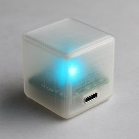

# 🐦‍⬛ Munin

Munin helps you track time for different tasks during your work day. Each face represents a different activity — just flip the cube to start logging time for a specific task (ex. _"Product support"_, _"Emails"_, _"Coding"_ etc). Add labels to each side if you want.

* 3D-printed
* Bluetooth connected
* Subscription-free (unlike for example Timeular and EARLY)
* Hackable

Depending on usage, battery time should be 2-8 weeks.



## Hardware
The device consists of a 3d printed translucent enclosure, a single board for control and connectivity, plus a battery.

- 3D-printed translucent enclosure (STL to come)
- Seeed XIAO nRF52840 Sense — BLE + IMU + USB-C microcontroller
- LiPo battery (3.7 V, EEMB 803030 with PCM)

Total cost of components is something like 40€ at the moment. Could be lowered significantly but that would make assembly much more cumbersome.

### LED feedback
The internal LED provides status feedback:

- :rainbow: Face switch confirmation (short glow in configured color)
- :red_square: Low battery (pulsing red)
- :green_square: Charging (pulsing green) and fully charged (steady green)
- :blue_square: Bluetooth pairing mode

### Bluetooth pairing
Pairing is triggered when the USB-C connector side is UP and USB is connected.

## Software
The Munin time tracker has, besides its own firmware, a CLI based app that handles connectivity, configuration and writes to a log file. The app is based on python and `bleak` and will work on macOS, Windows and Linux. It will not require root and will probably be distributed using something like `pipx install munin-client`. We shall see.

### Log file format
/logs/
munin_time_log.csv       # Primary tracked time
```
timestamp_start,timestamp_end,duration_sec,activity_face,activity_label,notes
2025-07-29T08:00:00Z,2025-07-29T09:30:00Z,5400,2,Coding,
2025-07-29T09:30:00Z,2025-07-29T09:45:00Z,900,5,Coffee Break,
2025-07-29T09:45:00Z,2025-07-29T10:15:00Z,1800,3,Emails
```
munin_events.log         # System, connection, and status events
```
2025-07-29T10:02:51Z BOOT reason=cold firmware=1.2.0
2025-07-29T10:02:54Z BLE_CONNECTED peer=MacBook-Pro
2025-07-29T10:44:00Z BATTERY_WARNING voltage=3.51V
2025-07-29T10:50:12Z CHARGING_STARTED source=usb
2025-07-29T10:55:33Z CHARGING_ENDED voltage=4.19V
```

### Configuration
- Label and color for each side.
- Time log file location
